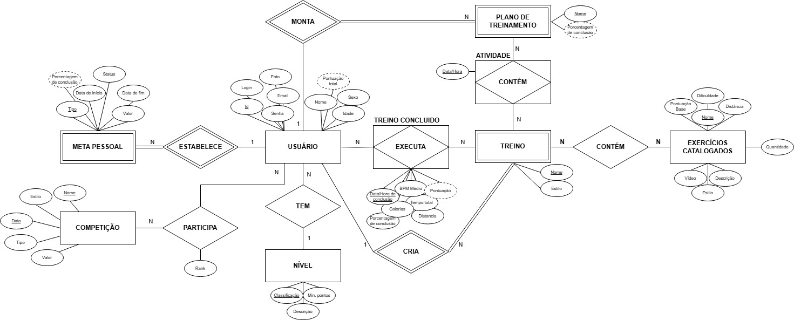

Dauphin é uma aplicação para quem gosta de nadar e pratica a natação. Nele você pode criar treinos compartilhados, planos de treinamento, registrar seus treinos, visualizar sua evolução, definir metas para o futuro e criar competições (privadas ou públicas).

# 🎲 Estrutura da base de dados

O diagrama entidade-relacionamento apresentado na Figura 1 apresenta a formação básica da base de dados. Para informações mais detalhadas, incluindo regras, restrições e outros diagramas, veja o <a href="database.md">database.md</a>.

###### *
Figura 1: diagrama ER da base de dados.
* 